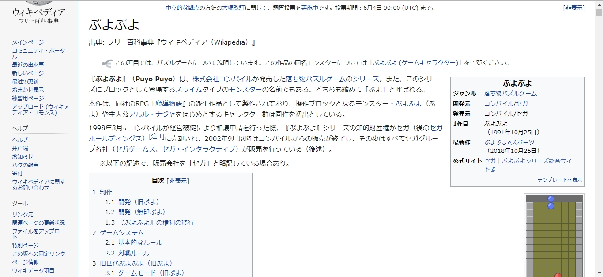
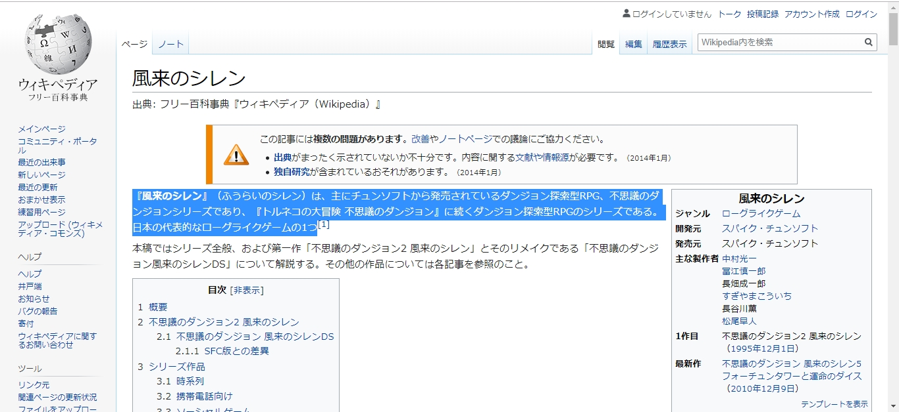

# quick ref 説明
Webページを記事に引用する時の補助ユーザースクリプトです。  
[Greasemonkey等にインストール（スクリプトへのリンク）](https://github.com/asamichi/quick_ref/raw/master/quick_ref.user.js)
## 機能
Ctrl+l で、現在のページタイトル、URLを取得し、下記フォーマットでクリップボードにコピーします。
```
参考：[タイトル]
url
```
ページ内の文章を選択した状態でCtrl+lを押した場合、選択箇所を引用部分として扱い、下記フォーマットでクリップボードにコピーします。
```
参考：[タイトル]
url
> [選択部分の文章]
```
"参考："とか引用符とか書く → タイトルをコピペする → URLをコピペする → 引用箇所をコピペする  
上記の流れを Ctrl+l で一発で終わらせます。

## 動作例
１．引用無し

```
参考:ぷよぷよ - Wikipedia
https://ja.wikipedia.org/wiki/%E3%81%B7%E3%82%88%E3%81%B7%E3%82%88
```

２．引用有り

```
参考:風来のシレン - Wikipedia
https://ja.wikipedia.org/wiki/%E9%A2%A8%E6%9D%A5%E3%81%AE%E3%82%B7%E3%83%AC%E3%83%B3
> 『風来のシレン』（ふうらいのシレン）は、主にチュンソフトから発売されているダンジョン探索型RPG、不思議のダンジョンシリーズであり、『トルネコの大冒険 不思議のダンジョン』に続くダンジョン探索型RPGのシリーズである。日本の代表的なローグライクゲームの1つ
```
## その他
### 出力形式の変更
スクリプト内の関数[gen]の返り値を加工すれば変更できます。
genは取得した文字列を引数として受け取って、簡単な加工をしているだけなので、簡単に変更できると思います。

### 割り当てているショートカットキーの変更
"   if (e.key === 'l' && e.ctrlKey && !e.shiftKey) {"
ここのlを別のボタンに変更すればそのキーに割り当てられます。
